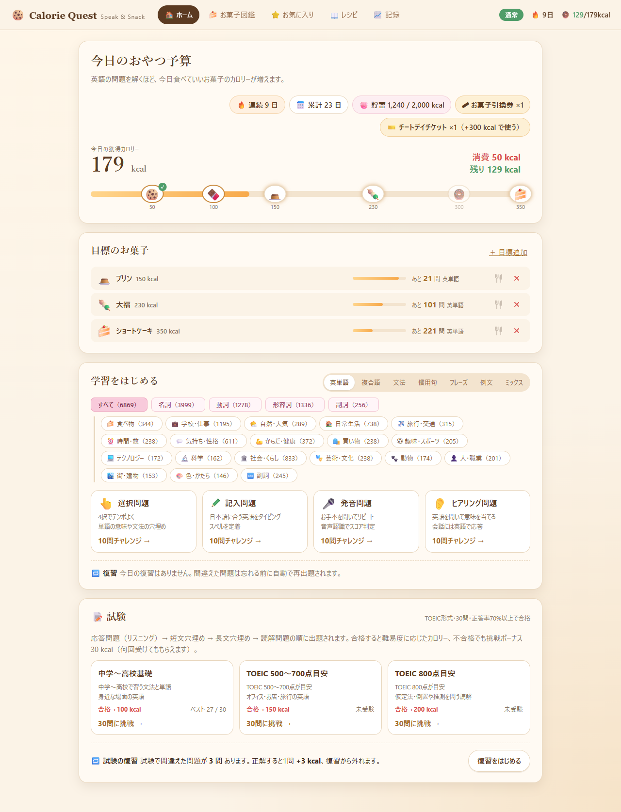
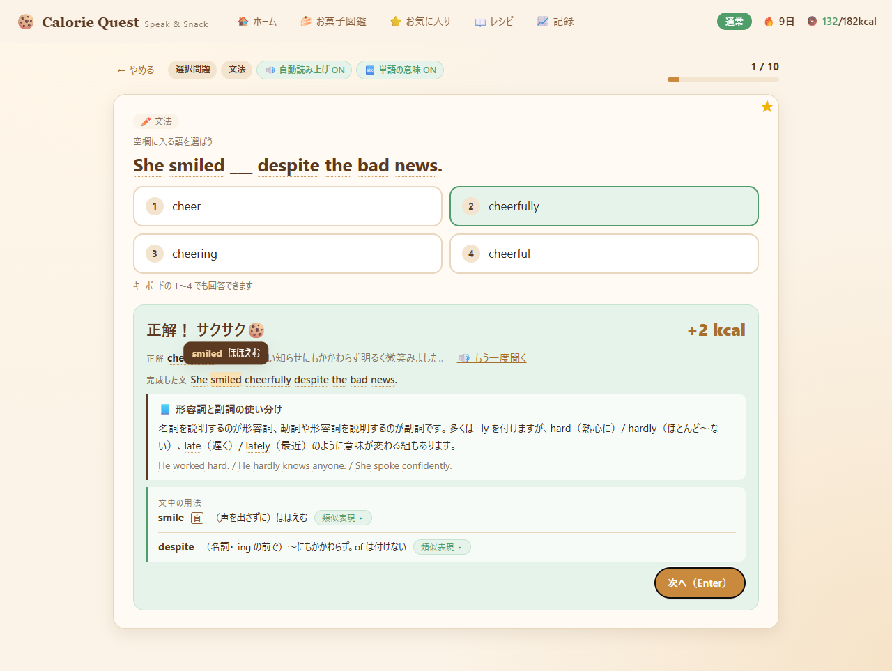
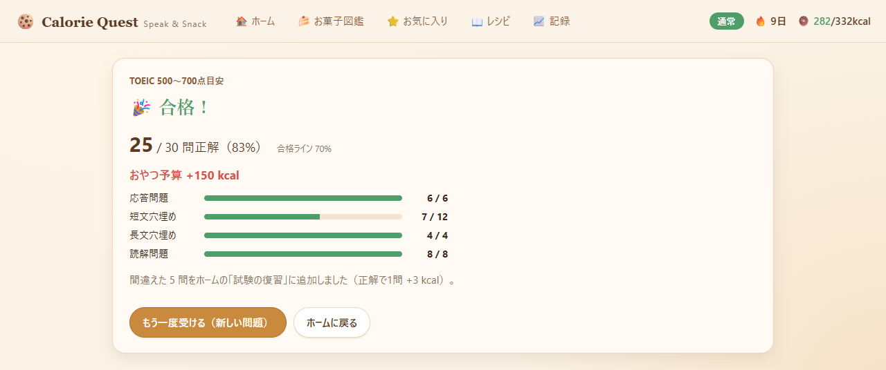
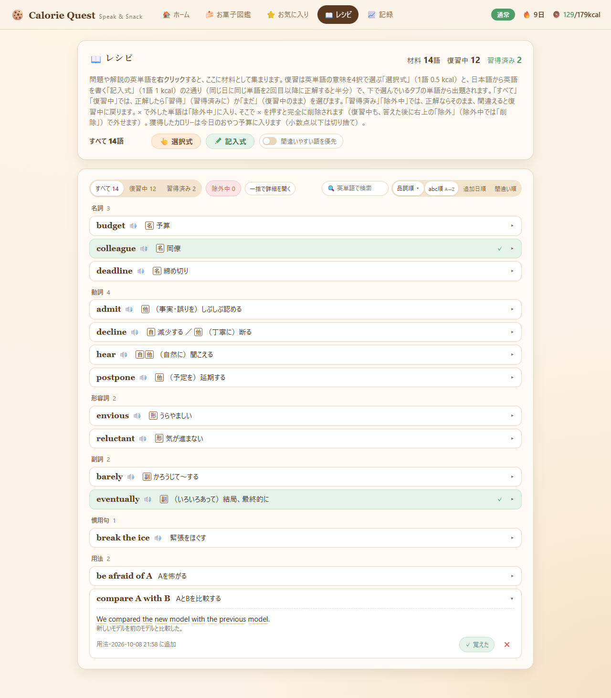
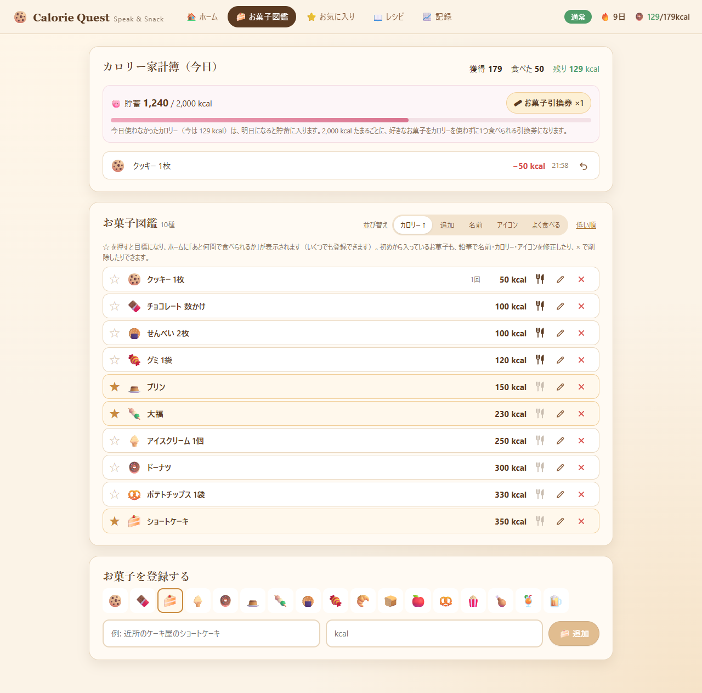
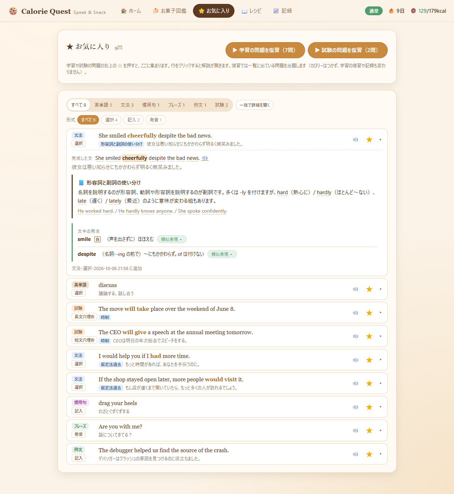
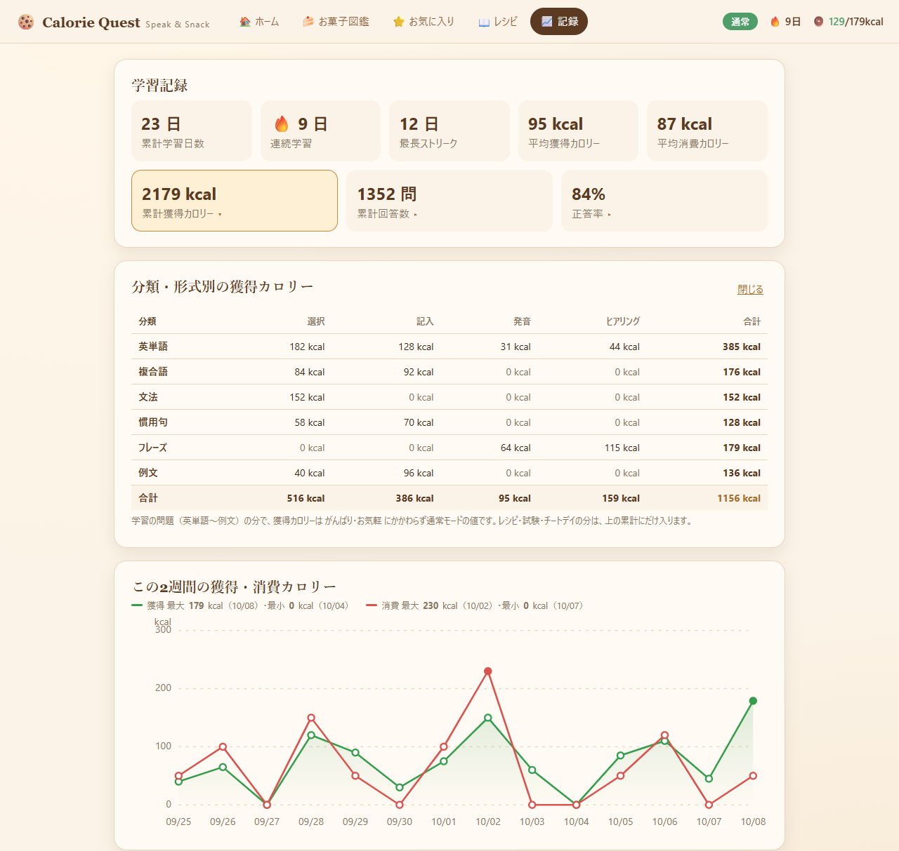

# Calorie Quest: Speak & Snack

英語の問題を解くと「今日食べていいお菓子のカロリー」が貯まる、軽量な英語学習ゲームです。
仕様は [docs/spec.md](docs/spec.md) を参照してください。



## 主な機能

- **学習**: 英単語（名詞・動詞・形容詞・副詞で絞り込み可）・複合語・文法・慣用句・フレーズ・例文の約2万3千問を、選択・記入・発音・ヒアリングの4形式で出題します。正解するとカロリーがもらえ、間違えた問題は翌日の復習に回ります。
- **解説**: 回答後に、単語の成り立ち・例文・用法（compare A with B、visit A には to を付けない など）・類似表現（lend / borrow / rent の違い）、文法ポイントの解説、その文で使われている用法が出ます。4択の誤答は正解と同じ品詞で、反対語や形の似た語など紛らわしいものから選ばれます。意味の前には四角い品詞のタグ（[名] 名詞・[形] 形容詞・[副] 副詞、動詞は [自] 自動詞・[他] 他動詞）が付き、意味ごとに品詞が違えば「[名] 場所、地点 ／ [他] 見つける」「[自] 走る ／ [他] 経営する」と分けて出ます（解説と単語帳）。類似表現にある語は、出題の日本語がそのニュアンスになり（admit なら「（事実・誤りを）しぶしぶ認める」）、近い意味の語と区別して答えられます。意味が複数ある語は、ニュアンスの付いた意味のほかの意味も残ります（decline なら「減少する、（丁寧に）断る」）。選択問題では答えた後、間違いの選択肢にもその英語（持ち寄り夕食会 → potluck dinner）が緑で出ます。
- **試験（TOEIC形式）**: 3つの難易度で30問（応答問題・短文穴埋め・長文穴埋め・読解問題）。70%以上で合格報酬、間違えた問題は試験専用の復習へ。
- **レシピ（単語帳）**: 英文の単語・熟語・用法を右クリックで登録し、選択式・記入式で復習します。
- **お気に入り**: 学習・試験の問題の右上の ☆ を押すと登録され、分類と出題形式で整理して解説ごと見返せます。お気に入りの問題だけを復習することもできます。
- **お菓子図鑑と目標**: 貯まったカロリーでお菓子を「食べる」記録をつけます。目標のお菓子まであと何問かが分かり、使わなかったカロリーは貯蓄してお菓子引換券になります。
- **遊び方（モード）**: がんばり（獲得カロリー ×0.5）・通常・お気軽（×1.5）を画面右上のボタンで切り替えられます。
- **記録**: 学習日数・連続日数・1日あたりの平均獲得／消費カロリー、分類×出題形式ごとの獲得カロリー・回答数・正答率、この2週間の獲得・消費カロリーの折れ線グラフを見られます。

| 単語問題の解説（例文・用法・類似表現） | 文法問題の解説と単語の意味 |
| --- | --- |
| ![英単語 discuss の選択問題に正解したところ。選択肢はニュアンス付き（（質問・電話・手紙に）答える など）で、間違いの選択肢に緑で英語（describe・answer・say）、例文、用法 [discuss A：about は付けない]、開いた類似表現（discuss と talk の違い）、右上の★（お気に入り）](docs/screenshots/word.png) |  |

| 試験（TOEIC形式の長文穴埋め） | 試験の結果 |
| --- | --- |
|  |  |

| レシピ（単語帳） | お菓子図鑑（家計簿・貯蓄・並び替え） |
| --- | --- |
|  |  |

| お気に入り | 記録 |
| --- | --- |
|  |  |

<sub>画面はブラウザプレビュー（`npm run dev`、モックデータ）で撮影したものです。数値はデモ用です。</sub>

## 技術構成

- バックエンド / コアロジック: **Rust**（Tauri 2, rusqlite）
- フロントエンド: **React + TypeScript**（Vite）
- 音声: Windows 標準の音声機能を Rust から利用（SAPI5 読み上げ、WinRT `SpeechRecognizer`）。モデルは同梱しません。
  ブラウザプレビュー時は Web Speech API を使います。
- データ: **SQLite**（`%APPDATA%\com.calorie-quest.app\calorie_quest.db`）

> **発音判定について**: Tauri が使う WebView2 は Web Speech API の音声認識に対応していない（`network` エラーになる）ため、
> 発音判定は Windows 内蔵の音声認識で行います。**英語（米国）の音声認識パック**が必要です:
> 設定 → 時刻と言語 → 言語と地域 → English (United States) を追加 → 言語のオプション → 「音声認識」をインストール。
> 未導入の環境では、アプリ内に手順を表示し、自己採点にフォールバックします。
> 導入済みかどうかは `cd src-tauri; cargo test native_english -- --ignored --nocapture` で確認できます。

## 必要なもの

- Rust（stable, MSVC ツールチェーン）と Visual Studio Build Tools（C++）
- Node.js 20 以上
- WebView2 ランタイム（Windows 11 には標準で入っています）

## 開発

```bash
npm install
npm run tauri dev
```

PowerShell からは `.\dev.cmd` でも起動できます（初回は `npm install` も実行）。
Node.js が未導入なら `winget install OpenJS.NodeJS.LTS` で入れてから、新しいターミナルを開いてください。

ブラウザだけでUIを確認したいときは `npm run dev` で http://localhost:1420 を開きます。
このときはRustの代わりにブラウザ内のモックバックエンド（`src/lib/mockBackend.ts`）が動きます。

## ビルド

```bash
npm run tauri build
```

`src-tauri/target/release/` に実行ファイル、`bundle/` にインストーラーが生成されます。

## テスト

```bash
cd src-tauri && cargo test
```

音声機能の診断ログを出したいときは、環境変数 `VITE_SPEECH_PROBE=1` を付けて `npm run tauri dev` を実行すると、
起動時に TTS / 音声認識の対応状況がターミナルに出力されます。

## ルール（仕様より）

ホームの分類（タブ）は **英単語 / 複合語 / 文法 / 慣用句 / フレーズ / 例文**（とミックス）です。英単語は1語の単語と句動詞（get up、look forward to など122語）で6,869語、複合語は traffic light や ex-boyfriend のように複数の語で1つの意味になる名詞・形容詞など（660語）です。複合語にするのは、辞書の見出しになる決まった言い方（steering wheel、vending machine、tuition fee）だけで、語の意味を足しただけの組み合わせ（dog bowl、words of encouragement）は出題しません。専門的な複合語（standard deviation、tectonic plate）は補助語彙に置き、英文のホバーとレシピ登録だけができます。
英単語のタブでは、ジャンル（食べ物・科学…）の上の段で **名詞（2,330）/ 動詞（702）/ 形容詞（598）/ 副詞（201）** に絞り込めます。品詞は問題の日本語の意味で決めています（watch は「腕時計」なら名詞、「見守る」なら動詞）。

| 分類 | 入っている問題 |
| --- | --- |
| 英単語 | 1語の英単語と句動詞（名詞・動詞・形容詞・副詞で絞り込み可） |
| 複合語 | 複数の語で1つの意味になる英単語 |
| 文法 | 文法の穴埋め、文法の学習になる例文・長文 |
| 慣用句 | 慣用句、慣用句を使った例文・長文 |
| フレーズ | 丸暗記したい会話フレーズ、日常会話の例文、会話応答 |
| 例文 | それ以外の例文・長文 |

正解したときのカロリー（1点 = 1 kcal）は、問題の種類と出題形式で決まります。慣用句・文法などのタブに入っている例文・長文は「文」として数えます。

| 問題の種類 | 選択 | 記入 | 発音 | ヒアリング |
| --- | --- | --- | --- | --- |
| 英単語 | 1 | 2（ヒントを1語でも開示すると 0） | 1 | 1 |
| 複合語 | 2 | 4（ヒント1語ごとに半分） | 2 | 2 |
| 慣用句 | 2 | 5（ヒント1語ごとに半分） | 3 | 3 |
| 文法・フレーズ・例文 | 2 | 1語につき 1（下記） | 5 | 5 |

- 発音問題は音声認識スコア（0〜100）に応じて按分（5点の文を80点で読めば 4 kcal）。60点以上で正解、65点未満は復習に回ります。
  - スコアは発音の「一致」だけで決まり（Windows の音声認識が、お手本の文を候補の中から選べたか）、**話す速さと声の高さは使いません**。正確に言えていれば、ゆっくりでも速くても同じ点です。認識エンジンの確信度は声の質で変わるので、点数への影響を小さくしています（お手本の文と認識されれば、確信度が低くても一致は90%以上）。エンジンが自信を持てず答えを出さなかったときも、いちばん近い候補がお手本の文なら「はっきりしない」として60〜80%の一致で採点します。
  - 「🎤 マイクで話す」を押すと、認識の準備ができるまで「準備中…（まだ話さないでください）」と出て、「● 録音中 — 話してください」に変わってから聞き取りが始まります（準備中に話すと出だしが録音されないため）。声は届いたのに聞き取れなかったときは、その回をやり直し回数に数えずに、もう一度話せます。
- 発音問題の英文の下には **発音記号**（米国英語、第1強勢に ˈ）が出ます。記号を右クリック（クリックでも可）すると、下の「💡 発音のコツ」にその音の出し方と例が表示され、th・r・l・f/v・w の音は口の断面図も出ます。発音記号は [CMU Pronouncing Dictionary](https://github.com/cmusphinx/cmudict) から作っており、辞書にない語（一部の料理名や新語）はつづりのまま表示されます。
- ヒアリング問題は英語を聞いて意味を選び、会話問題では自然な応答を英語で選びます。
- 文を書く記入問題（例文・長文・フレーズ）は、**答えの1語につき 1 kcal**。ヒントで単語を1つ開示するごとに **1 kcal 減点**します（"He likes cooking." なら 3 kcal、cooking を開示して正解すると 2 kcal、全部開示すると 0 kcal）。
  打ち間違えも**間違えた語の分だけ減点**します。"He like cooking." と答えたら 1語ちがいで 2 kcal（違う語・抜けた語・余分な語がそれぞれ1語分）。完全に正解しなかった問題は、翌日の復習に回ります。回答後は「あなたの答え」で間違えた語に印が付きます。
- 英単語の記入問題でヒントを1語でも開示すると **0 kcal**、複合語と慣用句の記入問題では **1語開示するごとに獲得カロリーが半分**になります（四捨五入）。
- 記入問題のヒント（伏せ字）は、学習画面の「💡 ヒント常時表示」を ON にすると最初から表示されます。表示するだけなら減点はなく、単語を開示したときだけ上のとおり減点されます。
- 画面右上の 🍩 の **129/179kcal** は、今日の **残りカロリー**（獲得 − 食べた分。緑、マイナスなら赤）／ **獲得カロリー** です。
- 画面右上（🔥連続日数の左）のボタンで **遊び方（モード）** を切り替えられます。クリックするごとに **がんばり**（赤・すべての獲得カロリーが半分）→ **通常**（緑・等倍）→ **お気軽**（青・1.5倍）の順に変わり、カーソルを合わせると説明が出ます。学習・単語帳・試験・チートデイなど、カロリーがもらえるものすべてに掛かります（がんばりで英単語の選択問題に正解すると 0.5 kcal）。1 kcal に満たない端数はその日のうちに次の獲得と合わせて 1 kcal になり、日付が変わると切り捨てです。回答後のカロリーの横には「がんばり ×0.5」のように今のモードが出ます。
- 間違えた問題は翌日の **復習** に入り、復習で正解すると **×1.5**。
  復習は**間違えたときと同じ形式**で出題されます（記入問題で間違えたフレーズは記入問題で、選択問題で間違えた単語は選択問題で）。ホームの「復習をはじめる」では、今日の復習だけをそれぞれの形式で出題します。
  - 復習で正解すると **消化** です（発音問題は65点以上。ふつうの学習に混ざって出た復習を正解しても消化です）。すぐ正解した問題は、その問題の復習はおしまいです。
  - その日の復習で間違えてから消化した問題は、**3日後** にもう一度復習に出ます。選択問題とヒアリングは **1回でも** 間違えたら、記入問題と発音問題は **3回以上** 間違えたら（1文字の打ち間違いや音声認識の揺れでも間違いになるため）です。数えるのはその日の間違いだけで、前の日までの分は数えません。3日後の復習でもまた間違えれば、同じように3日後にもう一度出ます。
  - 復習で間違えると **0 kcal**（文を書く記入問題の部分点もなし）で、**正解するまでその日の復習に残ります**。10問の回の最後に「間違えた復習 N 問をもう一度」が出て、すぐ解き直せます。押さなくても、次の「復習をはじめる」でまた出ます。
  - その日のうちに消化できなかった復習だけが翌日に繰り越されます。繰り越しが **7日** を超えた復習は、復習から外れて通常の出題に戻ります（そこでまた間違えれば、翌日の復習に入ります）。
  - 通常の学習で間違えた問題は、これまでどおり翌日の復習に入ります。
- 7日連続学習ごとに **チートデイチケット（+300 kcal）** を発行。
- **目標のお菓子** はいくつでも登録できます。ホームの「＋ 目標追加」を押すと、名前・カロリー・アイコン・追加が1行の入力欄が出ます。名前を打つと、その文字を含む図鑑のお菓子が下に候補として出て（「ポップ」ならポップコーン・ポップキャンディー・ロリポップ、「コーン」ならポップコーン。ひらがなでも見つかります）、選ぶと名前・カロリー・アイコンが図鑑どおりに入ります。候補を選ばずに新しいお菓子を書いて追加すると、お菓子図鑑にも登録されます。お菓子図鑑の ☆ を押して ★ にしても目標になります。ホームには目標ごとに1行で、残りカロリーに対する進み具合のゲージと「あと何問で食べられるか」（今日の残りカロリーから計算した英単語の問題数。カーソルを合わせるとフレーズ・文法、慣用句・長文の問題数も出ます）、ナイフとフォークのボタン（食べた）と赤い ×（目標から外すだけで、図鑑には残ります）が並び、今日食べた目標には「✓ 今日食べた」が付きます。
- お菓子図鑑のお菓子は、初めから入っているものも含めて、鉛筆のボタンで **名前・カロリー・アイコンを修正**、× で **削除** できます（× を押すと「削除する／やめる」を聞きます。初めから入っているお菓子は削除すると元に戻せません）。目標にしているお菓子を修正すると目標にも反映され、食べた記録はそのときの名前・カロリーのまま残ります。
- お菓子図鑑は1行に1つのリストで、**カロリー順**（初期設定）・**追加順**・**名前順**・**アイコン順**・**よく食べる順**（食べた回数）に並び替えられます。もう一度押すと逆順になり、選んだ並び順は次回も使われます。
- 「今日のおやつ予算」のバーは、**今日まだ使える残りカロリー**（獲得 − 食べた分）を示します。500 kcal 獲得して 300 kcal のお菓子を食べたら、バーは 200 kcal まで戻り、200 kcal を超えるお菓子は届いていない表示になります。
- バーに並ぶお菓子のアイコンを**クリックすると、そのお菓子を食べた記録**になり、カロリーが消費されます（取り消しはお菓子図鑑の家計簿の ↶ から）。今日食べたお菓子のアイコンには ✓ が付きます。
- 「食べた」はナイフとフォークのボタンです。今日の残りカロリーで食べられるお菓子はこげ茶、足りないお菓子はグレーアウトで表示されます（グレーでも押せば記録できます）。削除は赤い ×、取り消しは茶色の ↶ です。
- その日に使わなかったカロリー（獲得 − 食べた分）は、翌日になると **貯蓄** に入ります。翌日の予算に持ち越すのではなく別枠で、**2,000 kcal たまるごとに「お菓子引換券」1枚** に変わります。ホームか図鑑の「🎟 お菓子引換券」を押すと、ホームの目標のお菓子とお菓子図鑑の各お菓子に「🎟 引換券」ボタンが出て（もう一度押すと隠れます）、好きなお菓子をカロリーを使わずに1つ食べられます。どちらで使っても1枚減り、引換券がなくなるとボタンも消えます（取り消すと引換券は戻ります）。食べすぎた日も貯蓄は減りません。
- 選択・記入問題は回答後に英語を自動で読み上げます（学習画面の「自動読み上げ」で切り替え）。
- 文法問題は回答後に、空欄を埋めた完成文とその文法ポイントの解説が表示されます。
- 英単語は、接頭辞・語根・接尾辞に分けると覚えやすい語（699語）なら、回答後の正解の下に **成り立ち** が出ます（例: 接頭辞 de-「下へ」＋ 語根 press「押す」＋ 接尾辞 -ion「〜すること」→ depression「うつ病」）。分け方は1語ずつ確かめて書いたもので、mother を moth＋-er と分けるような機械的な誤りはありません。語源がはっきりしない語や、分けるとかえって誤解を招く語は分けていません。
- 成り立ちの部品のうち、同じ意味で使われている語がほかにもあるもの（点線の枠に ▸ が付いた部品、82グループ）は、クリックすると **関連語** が開きます。1つの部品につき原則3語まで（spect「見る」だけは4語）で、それぞれの成り立ち（共通の部品を色付き）・訳・共通点が短く出ます（例: confident の fid「信じる」→ confidence「信じる気持ち」・confidential「信頼した人にだけ明かす」、equilibrium の libr「天秤」→ deliberate「天秤で量るようによく考える」）。語源（ラテン語 fidere「信じる」など）は事実だけを書き、語呂合わせは載せていません。同じつづりでも意味が違う部品（connect の con-「共に」と confident の con-「すっかり」）は別に扱い、適切な関連語のない部品は押せません。関連語は閉じた状態から始まるので、解説が長くなることはありません。
- 英単語は回答後に、その単語を使った **例文**（全7,529語。問題集にその意味で使っている文があればそれを、なければ新しく書いた文）が出ます。前置詞などと組み合わせて使う動詞・形容詞・副詞（793語）には **用法** も出ます（visit A「to は付けない」、be supposed to [原]、almost all A「almost people とは言わない」、go abroad など）。句動詞は、その動詞の用法のうち句動詞で始まるもの（look forward to なら「look forward to A／-ing」）が出ます。用法が複数ある語はそれぞれに例文が付きます（例: [compare A with B：AとBを比較する] We compared the new model with the previous model. ／ [compare A to B：AをBに例える] He compared his life to a journey. ／ [be/feel envious of A：Aをうらやましく思う]）。用法の書き方は、名詞が入る部分が「A」（2つあれば A と B）、人なら「人」、動名詞なら「-ing」で、動詞の原形・形容詞・節は四角の [原] [形] [節] で示します（too [形] to [原]、I'm afraid (that) [節]）。いくつかの形が入るときは「look forward to A／-ing」のように「／」で並べ、「dance to A：A（音楽）に合わせて踊る」のように何が入るかを訳に添えます。例文の 🔊 で読み上げられます。
- 用法の右の **類似表現** を押すと、意味が近い語や混同しやすい語（247グループ）が開き、それぞれの違いと用法が出ます。lend なら borrow「（無料で）人から物を借りる」・rent「（お金を払って）借りる・貸す」・owe、afraid なら scared・terrified・scary「（物事が）怖い。人を怖がらせる側を言う」・creepy「（物・場所・人が）不気味でぞっとする」、embarrassed なら ashamed「自分の悪い行いを道徳的に恥じている」・shy など。-ed と -ing（interested と interesting など）の区別もあります。 意味は似ていても使い道の違う語もまとめてあります（expect「当然そうなると思う」・predict「データなどから予測する」・forecast「天気などを予報する」・estimate「見積もる」、job「数えられる仕事・職」と work「数えない仕事」、during「名詞の前」・while「主語と動詞の前」・for「期間の長さ」、affect「影響する（動詞）」と effect「影響（名詞）」、few / little、economic / economical など）。
- 文法・慣用句・フレーズ・例文・会話の問題でも、回答後に **文中の用法** が出ます。文の中の語のうち、その文が実際に使っている形だけを出します（"She compared her life to a journey." なら [compare A to B] だけで、compare A with B は出ません。"He is capable of finishing the project alone." なら [be capable of A／-ing]）。discuss（about は付けない）のような前置詞の注意と、creepy や lend のように混同しやすい語は、その語があれば出ます（"Could you lend me your textbook?" なら lend のニュアンス「（無料で）人に物を貸す」と、文がそのまま使っている [lend 人 A／lend A to 人]）。語ごとに「類似表現」も開けます。have・get・take・make・go のように意味の多すぎる基本語は、その文で用法が見つかったときだけ出します。
- **不規則動詞** は回答後に「原形-過去形-過去分詞」が出ます（cut-cut-cut、buy-bought-bought、get-got-got / gotten）。句動詞は動詞の部分だけの活用です（come back なら come-came-come）。英単語の動詞の問題ではその語の、文法・慣用句・フレーズ・例文・会話・試験の問題では文が使っている不規則動詞（She **bought** a new car. なら buy）の活用です。🔊 を押すと3つを約0.3秒ずつ間をあけて続けて読み上げ、読んでいる形に色が付きます（read は「リード、レッド、レッド」と読みます）。アプリ内の音声では3語をまとめて合成し、前後の無音を削ってから 0.3 秒の無音でつなぐので、間はいつも同じです。be は文に必ずと言っていいほど出るので出さず、助動詞の do・have（Did you go? / I have finished）、名詞の使い方（a cut、the building、a TV show、turn left）も数えません。活用の一覧は `src-tauri/data/irregular-verbs.json`（142語）です。
- 慣用句は、成り立ちがはっきりしているもの（437句）に回答後 **由来** が出ます（例: bite the bullet「麻酔がなかった時代の戦場で、兵士が手術や激痛に耐えるために弾丸をかんで我慢したことから…」）。説が分かれるものは「〜とされる」と書くか、載せていません。

## 問題データ

`src-tauri/data/` に23,188問。分類（英単語・複合語・文法・慣用句・フレーズ・例文）と26ジャンル、英単語は品詞でも絞り込めます。

| 種類 | 問題数 | 分類 | ファイル |
| --- | --- | --- | --- |
| 英単語 | 7,529 | 英単語（6,869。句動詞122を含む）・複合語（660） | `questions.json`, `words-2a/2b/3〜17/20〜26.json`, `words-cefr-1〜4.json`（中学〜高校の CEFR-J A1〜B2 と TOEIC Service List から足した3,240語）（品詞は `word-pos.json`（複合語も全体の意味で）。`words-20.json` は副詞114語、`words-21.json` は基本動詞351語、`words-22.json` は基本形容詞236語、`words-23.json` は句動詞109語、`words-24.json` は動詞41語・形容詞58語、`words-25.json` は副詞76語） |
| 文法（穴埋め4択） | 1,983 | 文法 | `questions.json`, `grammar-2〜9.json` |
| 慣用句 | 1,611 | 慣用句 | `questions.json`, `idioms-2〜8.json` |
| 丸暗記フレーズ | 297 | フレーズ | `expressions.json` |
| 例文 | 4,717 | 1文ずつ振り分け | `questions.json`, `phrases-2〜21.json` |
| 長文 | 1,900 | 1文ずつ振り分け | `questions.json`, `sentences-2〜14.json` |
| 会話応答（ヒアリング専用） | 5,151 | フレーズ | `listening-dialogues.json`, `-2〜53.json` |

例文と長文は1文ずつ分類を決めてあります（`tiers.json`）。慣用句を比喩として使っている文は「慣用句」、日常会話でそのまま使う文は「フレーズ」、現在完了・受け身・関係代名詞・比較・仮定・間接疑問などの文法の学習になる文は「文法」、それ以外は「例文」です。丸暗記フレーズ（"Who cares?" "I'd rather do it myself." "Anything you say." "Is that clear?" など）は、あいさつ・あいづち / 気持ちを伝える / お願い・誘い / 質問・確認 / 意見・評価 / 決まり文句 の6ジャンルに分かれています。

ジャンル: 食べ物 / 日常生活 / 旅行・交通 / 買い物 / 学校・仕事 / 自然・天気 / からだ・健康 / 気持ち・性格 / 時間・数 / 動物 / 趣味・スポーツ / 色・かたち / 人・職業 / 街・建物 / テクノロジー / 科学 / 社会・くらし / 芸術・文化 / 副詞 / 文法 / 慣用句 / あいさつ・あいづち / 気持ちを伝える / お願い・誘い / 質問・確認 / 意見・評価 / 決まり文句

各問題はジャンルよりも細かい **意味グループ**（果物・乗り物・感情・移動の動詞など、単語は376種）を持ちます。

英単語の4択の誤答は、**正解と同じ品詞**の語の意味から選びます（動詞の win に「野球」「ハイキング」のような名詞が並ぶと、品詞だけで答えが分かってしまうため）。その中で次の順に優先します。

1. **混同しやすい語**（最大2つ）: 反対の意味（win と lose、cheap と expensive）、貸し借りのような対の動作（lend と borrow）、-ed と -ing（bored と boring）、rise と raise のような形の似た語（`word-confusables.json`、161組。put on と put off と put away、hand in と hand out のような句動詞も）と、つづりが1文字違いの語（house と horse・mouse、desert と dessert）
2. 同じ意味グループの語（「salt（塩）」ならこしょう・マヨネーズ）
3. 同じジャンルの語、同じ分類（英単語か複合語か）の語

正解と意味が重なる語は選びません。同じ訳の語、漢字を共有する訳（怒った と 激怒した、大きい と 巨大な）、類似表現で近い意味として並べた語（study と learn、win と beat）、同じつづりの別の意味（pass の「通り過ぎる」と「合格する」）は、正解がもう1つあるように見えてしまうため除きます。

慣用句1,611個にはすべて **例文と訳** が付いており、回答後に正解の下に表示されます（読み上げボタン付き）。

文法問題1,983問には、それぞれが問うている **文法ポイント**（現在完了・関係代名詞・仮定法過去など84種）のタグが付いています。回答すると、空欄を埋めた完成文と、そのポイントの解説・例文が表示されます。解説は `src-tauri/data/grammar-notes.json` にポイントごとに1件だけ置いてあるので、直せば同じ論点の問題すべてに反映されます。

追記するときは末尾に新しい `key` で追加し、`questions.json` 先頭の `version` を 1 つ上げると次回起動時に取り込まれます。新しいファイルは `src-tauri/data/` に置くだけで、Rust 側（`build.rs` が一覧を生成）とブラウザ側（`import.meta.glob`）の両方が自動で読み込みます。`cargo test` がキーの重複・文法問題の選択肢・**単語問題の**グループ内の訳の重複・グループの最小人数・単語の意味の網羅を検査します。

単語以外は同じグループで訳が重なっても構いません（「幸運を祈る」= *keep your fingers crossed* / *best of luck* のように、同じ意味の別表現は実際にあります）。記入問題では同じ日本語を持つ問題の英語をすべて正解として受け付けるので、どちらを書いても正解になります。

## 単語の意味ポップアップと単語の読み上げ

英文の単語にカーソルを合わせる（タップする）と日本語の意味が出ます。学習画面の「🔤 単語の意味」で切り替えでき、設定は保存されます。
辞書は単語問題7,529語と `glossary.json`（6,892語）から作られ（同じつづりで複数の意味を問う語は、その意味すべてと `glossary.json` にしかない意味を並べます。like なら「好む、気に入る、好き、〜のような」）、起動時に活用形（studies, running, bigger, busiest, lost, brought など）へ展開されます。

**熟語・慣用句はまとまりで意味が出ます。** "He always requests a **doggy bag** for leftovers." の doggy にカーソルを合わせると、1行目に「doggy bag 持ち帰り用の袋」、2行目に「doggy 犬の、ワンちゃん」と、熟語の意味と語自体の意味を並べて表示します。熟語の範囲は一続きの実線で示されます。
慣用句は同じ語の並びが文字どおりの意味でも使われるため（"The cat is **under the table**." は「テーブルの下に」）、意味の前に「慣用句なら」と添えます。doggy bag のような複合語には付きません。
熟語は複数語の単語問題（複合語660件と句動詞122件）と、`glossary.json` の複数語の見出しと、慣用句（1,611件）から作られ、慣用句は文中で活用していても代名詞が入れ替わっていても見つかります（"I'm **keeping my fingers crossed**" → keep your fingers crossed 幸運を祈る）。慣用句の94%が自分の例文の中で検出されます。
選択問題で熟語そのものの意味を問うているときは、回答するまで熟語の意味を伏せます。

**単語を左クリックすると、その単語だけを読み上げます。** 意味のポップアップとは独立しているので、「単語の意味」を OFF にしていても、辞書に載っていない固有名詞でも読み上げられます。問題文・完成した文・正解・例文・文法解説の例文、どこの単語でも同じように使えます。

## 試験（TOEIC形式）

ホームの「学習をはじめる」の下の **📝 試験** から、TOEIC に近い形式の30問を受けられます。難易度は3つです。

| 難易度 | 内容 | 合格報酬 |
| --- | --- | --- |
| 中学～高校基礎 | 中学～高校で習う文法と単語、身近な場面の英語 | 100 kcal |
| TOEIC 500〜700点目安 | オフィス・お店・旅行の英語。品詞・前置詞と接続詞・ビジネス語彙 | 150 kcal |
| TOEIC 800点目安 | 仮定法現在・倒置・分詞、推測や言い換え、発言の意図、文の位置を問う読解 | 200 kcal |

1回の試験は次の4パート（TOEIC の Part 2 / 5 / 6 / 7 にあたる）の順に出題されます。問題は各レベルの問題集（約180問ずつ: 応答問題32・短文穴埋め66〜69・長文穴埋め10本・読解40〜42問）から、パートごとに **まだ出していない問題を優先して** 選ばれます（全部出し終えたパートは、出してから日が経った問題から）。どのレベルも5回続けて受けるまで、同じ問題は出ません。

| パート | 形式 | 問題数 |
| --- | --- | --- |
| A 応答問題 | 英語を聞いて、最も適切な応答を3つから選ぶ（リスニング。音声は読み上げ） | 6 |
| B 短文穴埋め | 文の空欄に入る語句を4択で選ぶ（品詞・時制・前置詞・接続詞・関係詞・語彙など） | 12 |
| C 長文穴埋め | メール・お知らせなどの空欄4つ。うち1つは文を選んで入れる（文挿入） | 4 |
| D 読解問題 | 文章を読んで設問に答える（目的・詳細・言い換え・NOT 問題・発言の意図・文の位置） | 8 |

- 1問ごとにその場で正解と **解説** が出ます。完成した文と訳、聞こえた英語、本文の訳（長文）に加え、正解の語の **用法・類似表現** と、文が使っている **文中の用法** も出ます（学習画面と同じ）。英文の単語はカーソルで意味が見られ、右クリックで「レシピ」に登録できます。
- 30問を終えると採点され、**正答率70%以上（21問以上）で合格**。合格すると難易度に応じたカロリー、不合格でも挑戦ボーナス **30 kcal** がもらえます。どちらも回数の制限はなく、同じ日に何回受けてももらえます。
- 試験は途中で **中断** できます（左上の「← 中断する」。上のタブでホームなどへ移っても、アプリを閉じても同じ）。ここまでの回答は1問ごとに保存されていて、ホームのそのレベルのカードに「⏸ 中断中 3/30」と出ます。次にそのレベルを始めると「続きから再開しますか？」と聞かれ、**はい** で中断した続き（まだ答えていない最初の問題）から、**いいえ** で中断した試験を破棄して新しい問題で最初から始まります。中断した試験は、提出するまで記録も報酬もありません。
- 試験で間違えた問題は、学習の復習とは別の **🔁 試験の復習** に入ります。正解すると1問 **+3 kcal** で、復習から外れます（間違えると残ります）。次の試験で正解した問題も外れます。
- 問題は `src-tauri/data/exam-basic.json` / `exam-600.json` / `exam-800.json`（1件＝1問、または本文とその設問）。

## レシピ（単語帳）

問題文・正解・完成した文・文法解説・例文の英単語を**右クリック**すると、その単語が「📖 レシピ」タブに材料として登録されます。試験の本文（お知らせやメール）から登録したときは、本文全体ではなく、その単語のある1文が例文になります。
"heard" を右クリックすれば辞書形の hear（聞こえる）として登録され（went なら go のように、不規則動詞の過去形も辞書形になります）、見つけた文（と訳）が例文として一緒に保存されます。熟語の一部の単語（"doggy bag" の doggy など）を右クリックしたときは、まず「熟語『doggy bag』を登録しますか？」と聞き、「いいえ」のときだけ「『doggy』を単語として登録しますか？」と聞きます（熟語として難しいから登録したいのに、易しい単語だけが入ってしまわないように）。
選択問題に答えた後、間違いの選択肢は、枠内のどこを左クリックしてもその英語が読み上げられます（複合語・慣用句・フレーズ・例文は全体を読みます）。英語が単語・複合語・慣用句なら、その単語を右クリックして登録もできます（複合語・慣用句は、まずかたまりごと登録するかを聞きます）。フレーズや例文の選択肢の英語は登録の対象外です。
解説の **用法**（緑の太字の [compare A with B] や [be afraid of A]）は、太字のどこかを右クリックすると、その用法がひとまとまりでレシピに登録されます（単語の用法・類似表現・文中の用法のどこからでも）。用法は「人」「[原]」「-ing」などを含み読み上げられないので、レシピの一覧と復習では読み上げボタンを出しません（例文の 🔊 は使えます）。一覧の品詞順では「用法」としてまとまり、「用法のみ」にも絞れます。選択式の復習の誤答はほかの用法の意味から選ばれ、記入式では「A・B・人・-ing・[原]・[形]・[節]」などの部分を書かなくても正解になります（"compare with" でも "compare A with B" でも可）。「/」で並んだ語はどれか1つでよく（be confident in/about A は "be confident in" でも "be confident about" でも可）、「A／-ing」のような「／」の左右もどちらか一方で、( ) の語は書いても省いても正解です（I'm afraid (that) [節]）。
登録した用法・慣用句の解説には、先頭の動詞が不規則動詞ならその活用（split A into B → split-split-split）と、その用法と同じ意味で使う語の類似表現（split → 分ける: divide / separate / split / share）が出ます（be で始まる用法の be の活用のように、学ぶ意味の薄いものは出しません）。

レシピのタブでは登録した単語の一覧を見られ、2通りの復習ができます。

一覧のタブは **すべて・復習中・習得済み** と、その右に薄い赤の **除外中** です。「すべて」は除外中を除いた全部の単語です。
一覧は1語1行（単語と意味だけ）で、類似表現のある語の意味は復習の出題と同じニュアンスで出ます（admit なら「（事実・誤りを）しぶしぶ認める」）。行をクリックすると例文と訳、品詞、追加日時・復習回数・間違えた回数・習得日時が開きます（「✓ 覚えた」／「復習に戻す」と × もここ）。英単語のすぐ右の 🔊 で発音を聞けます。タブの右の「一括で詳細を開く」で、一覧に出ている語をまとめて開けます（すべて開いているときは「一括で詳細を閉じる」になります）。
× を押した単語は削除されずに **除外中** に移ります（カーソルを合わせると「レシピから除外」）。除外中のタブで × を押すと完全に削除され、「復習に戻す」で復習中に戻せます。除外中の単語をもう一度右クリックしたときも、復習中に戻ります。
タブの右には検索と並び替えがあります。

- **検索**: 入力した文字で**始まる**単語だけを残します（「b」なら barely・bare・beer、「bar」なら barely・bare。cab は残りません）
- **abc順／追加日順／間違い順**: どれか1つ。もう一度押すと逆順（A→Z ⇄ Z→A、新→古 ⇄ 古→新、多→少 ⇄ 少→多）。間違い順は、復習で間違えた回数の多い順で、各行に「間違い ○回」が出ます
- **品詞順**: 1回目で名詞 → 動詞 → 形容詞 → 副詞 → 慣用句 → 用法の順にまとめます（中の順番は abc順／追加日順に従う）。品詞が2つ以上ある語は、より一般的に使う品詞の1か所に並びます（book は名詞、どちらとも言えない figure・watch は 動詞 → 形容詞 → 名詞 → 副詞 の順で動詞）。2回目からはメニューが開き、「名詞のみ」のように1つの品詞（または慣用句・用法）だけに絞れます（中の順番は abc順／追加日順／間違い順に従う）。絞り込みでは、その品詞を持つ語がすべて出ます（figure は「名詞のみ」にも「動詞のみ」にも出ます）。複合語は全体の意味で分類します（traffic light は名詞、sign up は動詞）。問題集にない単語は登録した意味の形（～する・～い など）で推定します

| 復習 | 内容 | 1語正解あたり |
| --- | --- | --- |
| 👆 選択式 | 英単語（と見つけた例文）を見て、日本語の意味を4択から選ぶ（キーボードの 1〜4 でも回答） | 0.5 kcal（同じ日の2回目以降は 0.25） |
| ✏️ 記入式 | 日本語の意味と、その単語を空欄にした例文を見て、英語を入力する | 1 kcal（同じ日の2回目以降は 0.5） |

獲得したカロリーは今日のおやつ予算に入ります。同じ単語を同じ日に2回目以降に正解すると半分（選択式 0.25 kcal・記入式 0.5 kcal、3回目以降も同じ）です。小数点以下は切り捨てですが、1 kcal に満たない端数はその日のうちに次の正解と合わせて 1 kcal になります（日付が変わると切り捨て）。
「記入式」は、登録した形（heard）や、辞書でまったく同じ意味の別の単語を書いても正解です。
回答後には、学習画面と同じ **成り立ち・例文・用法・由来** が出ます（問題集にない単語でも、compare や depend のような基本語には用法があります）。登録した例文と、解説の例文・用法はどれも 🔊 で読み上げられます。
復習は、一覧で選んでいる **タブの単語** から出題されます（「すべて」なら除外中を除く全部、「復習中」「習得済み」「除外中」ならそのタブの単語。習得済みはしばらく復習していない単語から）。「すべて」「復習中」では、正解すると「次へ」の代わりに緑の **習得** と赤の **まだ** が出ます（なんとなく当たっただけなら「まだ」）。「習得済み」「除外中」ではこのボタンは出ず、正解ならそのまま「次へ」です。答えた単語はタブによって移ります。

| 復習するタブ | 正解したとき | 間違えたとき |
| --- | --- | --- |
| すべて・復習中 | 「習得」で習得済みに移る／「まだ」で復習中のまま | 復習中（習得済みの単語も復習中に戻る） |
| 習得済み・除外中 | そのまま | 復習中に戻る（「すべて」にも入る） |

答えた後は、カードの右上に赤い **× 除外** が出ます（「習得」「まだ」「次へ」とは離れた位置）。「もうこの単語は復習しなくていい」と思ったら、その場で除外中に移して次へ進めます。除外中の復習では **× 削除** になり、レシピから完全に削除します。外した単語は「覚えた」「まだ」の数にも「もう一度」にも入らず、終わりに「除外した（削除した）N語」と出ます。

「習得／まだ」の説明と「この単語は今日2回目以降の正解なので、カロリーは半分」の注意は、毎回出ると邪魔なので、それぞれその日の最初の1回だけ出ます。間違えた回数は単語ごとに記録されます。
「選択式」「記入式」の右の **間違いやすい語を優先** をオンにすると、間違えた回数の多い単語から出題されます（オン・オフは次に開いたときも残ります）。
習得済みの単語は、1語ずつ（×）、または「習得済みを片付ける」でまとめて除外中に移せます。
「選択式」「記入式」の行の右端には、タブごとにまとめて動かすボタンが小さく出ます: 復習中では **すべて習得済みへ**、習得済みでは **すべて復習中へ**、除外中では **一括削除**。押すと「復習中の12語をすべて習得済みに移しますか？」のように確認が出て、移す（削除する）か、やめるかを選べます。対象はそのタブの単語すべてです（検索や品詞の絞り込みにかかわらず）。一覧で単語を開き「✓ 覚えた」を押して直接習得済みにすることもできます。習得済みの単語をもう一度右クリックすると、復習中に戻ります。
レシピは学習記録のリセットでは消えません。

## お気に入り

学習（選択・記入・発音・ヒアリング）と試験（試験・試験の復習）の問題の枠の右上にある **☆** を押すと **★** になり、上のタブの「⭐ お気に入り」に登録されます。もう一度押すと外れます。学習の問題は **出題された形式ごと** に登録されるので、同じ単語を選択問題と記入問題で別々に登録できます。

- 一覧は1問1行で、英語（文法と試験の穴埋めは完成した文で、答えの語を太字に）と意味、文法ポイント（「to不定詞」「品詞」など）だけを出します。行をクリックすると、正解・訳・文法の解説・例文・用法・類似表現など、回答後と同じ解説が開きます（間違いの選択肢は出しません）。試験の長文は「本文を見る」で本文と訳を開けます。発音問題のお気に入りは、開くと学習画面と同じ **発音記号** が出ます（記号をクリックすると、その音の出し方が「💡 発音のコツ」に出ます）。
- 上のタブで **分類**（すべて・英単語・複合語・文法・慣用句・フレーズ・例文・試験）、その下のチップで **出題形式**（選択・記入・発音・ヒアリング、試験なら応答問題・短文穴埋め・長文穴埋め・読解問題）に絞り込めます。
- 行の ★ を押すとお気に入りから外れます（その場では薄く残り、もう一度押すと戻せます）。
- **この一覧を復習** で、いま一覧に出ているお気に入りだけを出題します（しばらく復習していない問題から10問ずつ）。学習の問題と試験の問題が両方あるときは、ボタンが「学習の問題を復習」「試験の問題を復習」に分かれます。お気に入りの復習は見返し用で、**カロリーはつかず、学習の復習や試験の復習、記録（累計回答数・正答率）も変わりません。**
- お気に入りは学習記録のリセットでは消えません。

## 記録

- 上の段に **累計学習日数・連続学習・最長ストリーク・平均獲得カロリー・平均消費カロリー** が並びます。平均は、累計の獲得カロリー（食べたお菓子のカロリー）を **学習した日数** で割ったもので、学習していない日は数えません（4日学習して 400 kcal 獲得なら 100 kcal）。
- **累計獲得カロリー・累計回答数・正答率** はクリックすると、学習記録とグラフの間に **分類（英単語・複合語・文法・慣用句・フレーズ・例文）× 形式（選択・記入・発音・ヒアリング）** の表が開きます（行・列ごとの合計付き）。同じ数字をもう一度押すか「閉じる」で閉じます。
  表は学習の問題の分で、獲得カロリーは がんばり・お気軽 にかかわらず **通常モードの値** です。上の累計獲得カロリーは実際にその日の予算に入った値（モードの倍率込みで、レシピ・試験・チートデイの分も含む）なので、表の合計と一致しないことがあります。
- **この2週間の獲得・消費カロリー** は折れ線グラフで、獲得（緑）と食べたお菓子の消費（赤）を重ねて出します。獲得はその日に実際に入った値（モードの倍率込み）です。縦軸は2週間の両方の値の最小〜最大に合わせたきりのいい目盛りで、凡例にそれぞれの最大・最小の日が出ます（グラフでは最大の日の点が塗りつぶし）。点にカーソルを合わせると、その日の値が出ます。
- 消費（赤）の点をクリックすると、点から小さなウィンドウが開いて、**その日に食べたお菓子** が「アイコン・お菓子名・個数・合計カロリー」の1行ずつ、合計カロリーの多い順に出ます（お菓子引換券で食べたものは「🎟 引換券」として最後に）。ウィンドウの外をクリックするか、× か Esc で閉じます。

## 構成

```
src/                 React フロントエンド
  lib/speech.ts      TTS / 音声認識（Tauri ではネイティブ、ブラウザでは Web Speech API）
  lib/scoring.ts     発音の一致度のスコア計算、発音のコツ検出
  lib/mockBackend.ts ブラウザプレビュー用のインメモリ実装
  lib/dictionary.ts  単語の意味ポップアップ用の辞書引き（活用形の解決）
  lib/recipe.ts      右クリックでレシピに登録する仕組み
  components/        カロリーバー、口の形の図解（SVG）、発音のコツと発音記号、単語ポップアップ、回答後の解説（成り立ち・例文・用法・類似表現）、お気に入りの☆、遊び方の切り替え
  screens/           ホーム / 学習 / 試験 / お菓子図鑑 / お気に入り / レシピ / 記録
src-tauri/
  src/db.rs          SQLite スキーマ、初期データ投入、辞書の構築
  src/srs.rs         カロリー換算と復習スケジュール
  src/commands.rs    フロントから呼ぶコマンド（ユニットテスト付き）
  src/recipe.rs      レシピ（単語帳）の保存・復習（カロリー付与・タブの移動・間違えた回数）・除外・削除
  src/exam.rs        試験（TOEIC形式）の出題・採点・報酬・試験の復習
  src/favorite.rs    お気に入りの登録・一覧・復習の記録
  src/speech.rs      SAPI5 読み上げ / WinRT 音声認識
  data/*.json        問題データ・会話データ・語彙集・文法解説・発音記号・単語の成り立ちと関連語・例文・用法・類似表現・慣用句の由来・品詞・混同しやすい語の組・試験問題（key で管理、追記可能）
scripts/
  make_pronunciations.py  CMU 発音辞書から発音問題の単語の発音記号（data/pronunciations.json）を作る
```

## ライセンス

[MIT License](LICENSE)

発音記号のデータ（`src-tauri/data/pronunciations.json`）は CMU Pronouncing Dictionary（Copyright (C) 1993-2015 Carnegie Mellon University）から作成しています。同辞書のライセンスは [src-tauri/data/cmudict-LICENSE.txt](src-tauri/data/cmudict-LICENSE.txt) を参照してください。

単語問題にする語は、次の語彙表と照合して選んでいます（表そのものはリポジトリに含みません。品詞が2つ以上ある語のどちらがより一般的かの順（`src-tauri/data/pos-order.json`）は、CEFR-J Wordlist の品詞別のレベルから作っています）。

- CEFR-J Wordlist Version 1.5（東京外国語大学 投野由紀夫研究室。[openlanguageprofiles/olp-en-cefrj](https://github.com/openlanguageprofiles/olp-en-cefrj)）
- TOEIC Service List 1.2（Browne, C. & Culligan, B. [newgeneralservicelist.com](https://www.newgeneralservicelist.com/toeic-service-list)、CC BY-SA 4.0）
